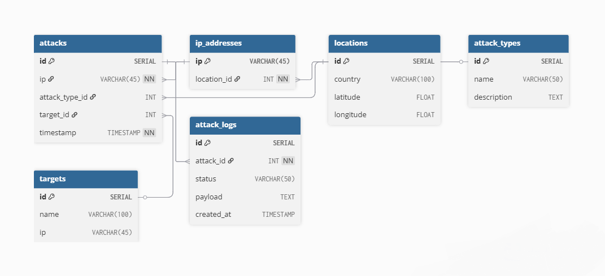

#  TÀI LIỆU THIẾT KẾ HỆ THỐNG

## Attack Visualization System

---

## 1. Giới thiệu

Hệ thống **Attack Visualization System** được xây dựng nhằm mục đích mô phỏng và hiển thị các sự kiện tấn công mạng theo thời gian thực. Hệ thống cho phép hiển thị địa chỉ IP nguồn tấn công trên bản đồ thế giới và theo dõi timeline các sự kiện.

---

## 2. System Architecture

###  Architecture Diagram


---

###  Workflow hệ thống

```plaintext
Client → API Gateway → Backend Service → Database
                    ↓
                 Redis Cache
                    ↓
             Message Broker
```


###  Mô tả luồng xử lý

1. **Client** gửi request hoặc nhận dữ liệu realtime

2. **API Gateway**:

   * Xác thực request
   * Điều hướng đến backend service

3. **Backend Service**:

   * Nhận attack events
   * Xử lý dữ liệu
   * Kiểm tra cache
   * Gọi geolocation API nếu cần

4. **Redis Cache**:

   * Lưu IP → location
   * Giảm tải hệ thống

5. **Message Broker (Redis Pub/Sub)**:

   * Xử lý event streaming
   * Hỗ trợ khi xảy ra log storm

6. **Database**:

   * Lưu trữ attack events

---

## 3. Database Design (3NF)

###  ERD Diagram




---

##  3.1 Tables & Data Types

###  Bảng `locations`

| Field     | Data Type    | Description |
| --------- | ------------ | ----------- |
| id        | SERIAL (PK)  | ID vị trí   |
| country   | VARCHAR(100) | Quốc gia    |
| latitude  | FLOAT        | Vĩ độ       |
| longitude | FLOAT        | Kinh độ     |


###  Bảng `ip_addresses`

| Field       | Data Type   | Description            |
| ----------- | ----------- | ---------------------- |
| ip          | VARCHAR(45) | Địa chỉ IP (IPv4/IPv6) |
| location_id | INT (FK)    | Liên kết location      |

---

###  Bảng `attacks`

| Field     | Data Type        | Description       |
| --------- | ---------------- | ----------------- |
| id        | SERIAL (PK)      | ID sự kiện        |
| ip        | VARCHAR(45) (FK) | IP nguồn tấn công |
| timestamp | TIMESTAMP        | Thời gian xảy ra  |

---

###  Bảng `attack_types`

| Field       | Data Type    | Description         |
|------------|-------------|---------------------|
| id         | SERIAL (PK) | ID loại attack      |
| name       | VARCHAR(50) | Tên loại            |
| description| TEXT        | Mô tả               |

---

###  Bảng `targets`

| Field | Data Type    | Description        |
|------|-------------|--------------------|
| id   | SERIAL (PK) | ID target          |
| name | VARCHAR(100)| Tên hệ thống       |
| ip   | VARCHAR(45) | IP mục tiêu        |

---

###  Bảng `attack_logs`

| Field      | Data Type    | Description        |
|-----------|-------------|--------------------|
| id        | SERIAL (PK) | ID log             |
| attack_id | INT (FK)    | Liên kết attack    |
| status    | VARCHAR(50) | Trạng thái         |
| payload   | TEXT        | Nội dung log       |
| created_at| TIMESTAMP   | Thời gian log      |

##  3.2 Chuẩn hóa (3NF)

Thiết kế đạt chuẩn **Third Normal Form (3NF)** vì:

* Không có dữ liệu dư thừa
* Không tồn tại phụ thuộc bắc cầu
* Dữ liệu được tách thành:

  * IP
  * Location
  * Attack Event

Quan hệ:

```plaintext
attacks → ip_addresses → locations
attacks → attack_types
attacks → targets
attacks → attack_logs
```
---

## 3.3 Indexing Strategy

Để đảm bảo hiệu năng khi hệ thống xử lý lượng lớn dữ liệu, các chiến lược indexing được áp dụng:

### Primary & Foreign Keys

- Primary Keys:
  - attacks.id
  - locations.id
  - attack_types.id
  - targets.id

- Foreign Keys:
  - attacks.ip → ip_addresses.ip
  - ip_addresses.location_id → locations.id
  - attack_logs.attack_id → attacks.id

---

### Single-column Indexes

```sql
CREATE INDEX idx_attacks_ip ON attacks(ip);
CREATE INDEX idx_attacks_timestamp ON attacks(timestamp);
CREATE INDEX idx_ip_location ON ip_addresses(location_id);
```

---

## 4. Handling High Event Rate

###  Vấn đề

* Số lượng attack events tăng đột biến
* Gây quá tải backend và database
* Ảnh hưởng đến realtime visualization


###  Giải pháp

#### 1. Message Broker (Redis Pub/Sub)

* Xử lý event streaming
* Buffer dữ liệu khi xảy ra log storm
* Giảm tải backend


#### 2. Redis Cache

* Cache IP → location
* Giảm số lần gọi Geolocation API
* Tăng tốc độ xử lý


#### 3. Batching

* Gom nhiều events trước khi gửi đến client
* Giảm số lượng request

---

## 5. System Expansion Strategy

###  Khi số lượng attack tăng mạnh


###  Load Balancer

* Phân phối request đến nhiều backend
* Tránh quá tải một server


###  Horizontal Scaling

* Nhân bản backend service (backend cloning)
* Tăng khả năng xử lý song song


###  Redis Scaling

* Redis Cluster để xử lý lượng lớn cache


###  Database Scaling

* Read replicas
* Partitioning nếu dữ liệu lớn

###  Event Streaming nâng cao

* Có thể thay Redis bằng Kafka khi hệ thống lớn hơn

---

## 6. Kết luận

Hệ thống được thiết kế theo kiến trúc event-driven, đảm bảo khả năng xử lý lượng lớn attack events. Việc sử dụng Redis Cache, Message Broker và Load Balancer giúp hệ thống hoạt động ổn định và có khả năng mở rộng khi lưu lượng tăng đột biến.
