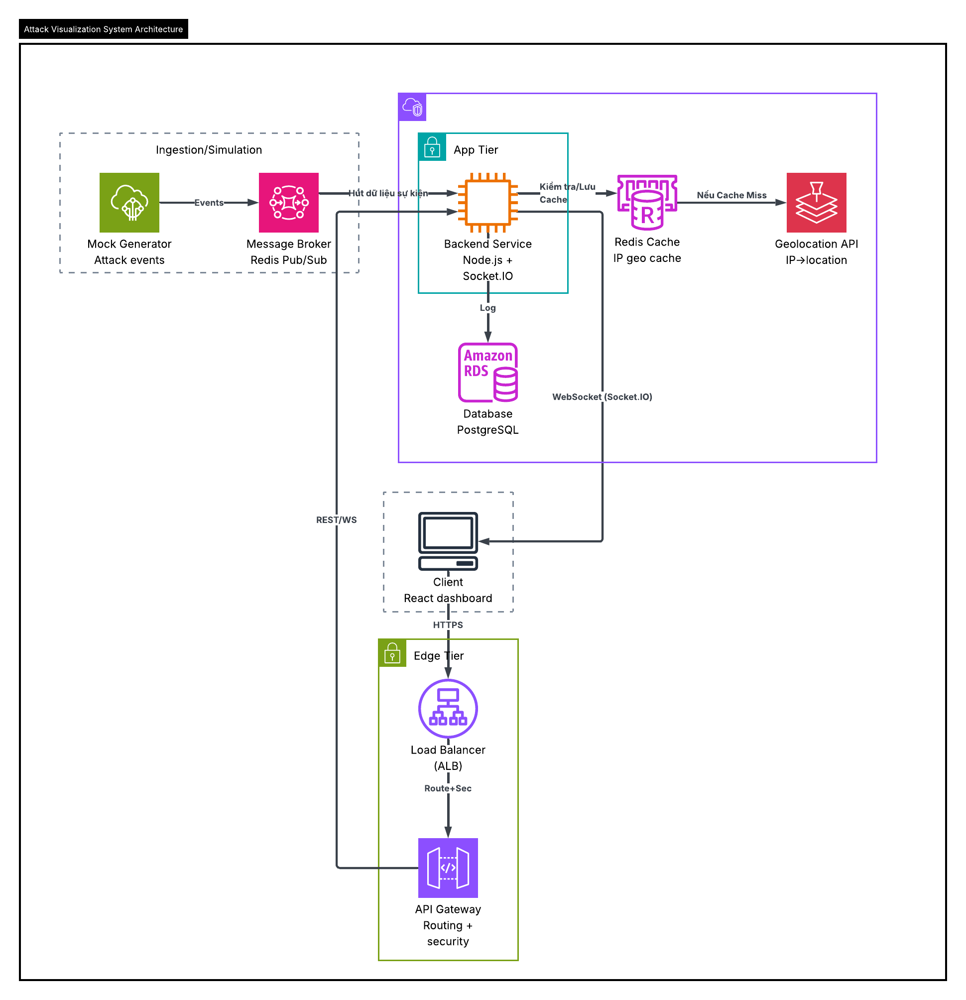
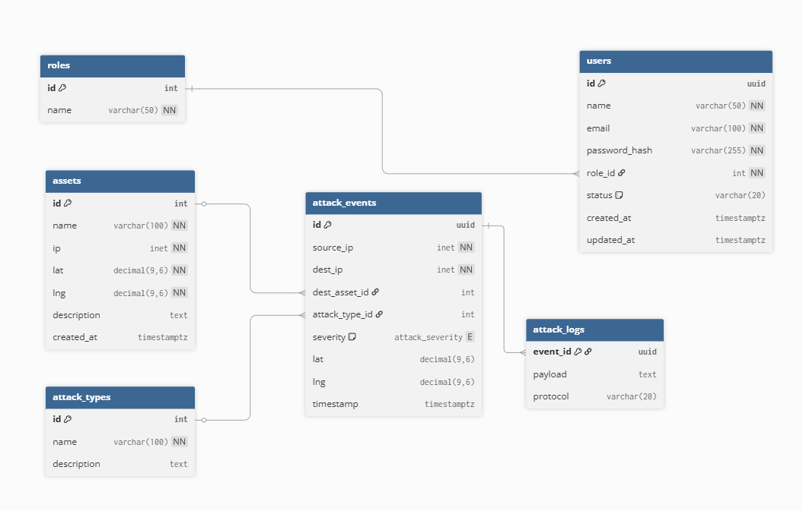

# TÀI LIỆU THIẾT KẾ HỆ THỐNG

## Attack Visualization System

---

## 1. Giới thiệu

Hệ thống **Attack Visualization System** được xây dựng nhằm mô phỏng và hiển thị các sự kiện tấn công mạng theo thời gian thực. Mục tiêu của hệ thống là tiếp nhận các attack events từ nguồn mô phỏng, xử lý và enrich dữ liệu, lưu trữ phục vụ truy vấn lịch sử, đồng thời phát dữ liệu đến dashboard để trực quan hóa trên bản đồ và timeline.

Hệ thống được thiết kế theo hướng **event-driven**, phù hợp với bài toán có tần suất sự kiện cao và yêu cầu cập nhật realtime.

---

## 2. System Architecture

### 2.1 Architecture Diagram



---

### 2.2 Workflow hệ thống

Do hệ thống hoạt động theo mô hình event-driven, workflow cần được tách thành các luồng chính thay vì mô tả tuần tự kiểu CRUD thông thường.

#### Luồng 1: Tiếp nhận và xử lý attack events

```plaintext
Mock Generator Attack Events
        ↓
Message Broker (Redis Pub/Sub)
        ↓
Backend Service (Node.js + Socket.IO)
   ├── Kiểm tra Redis Cache (IP → location)
   │       └── Nếu cache miss → gọi Geolocation API
   ├── Lưu dữ liệu vào PostgreSQL
   └── Phát dữ liệu realtime qua WebSocket đến React Dashboard
```

#### Luồng 2: Client truy cập dashboard

```plaintext
Client (React Dashboard)
        ↓ HTTPS
Load Balancer (ALB)
        ↓
API Gateway
        ↓
Backend Service
        ↓
PostgreSQL / Redis Cache
        ↓
Client
```

#### Luồng 3: Realtime visualization

```plaintext
Attack Event mới được xử lý
        ↓
Backend Service
        ↓
Socket.IO / WebSocket
        ↓
React Dashboard
        ↓
Cập nhật bản đồ, timeline, thống kê realtime
```

---

### 2.3 Mô tả luồng xử lý

#### a. Luồng ingest và xử lý event

1. **Mock Generator** sinh ra các attack events mô phỏng.
2. Các events được publish vào **Message Broker (Redis Pub/Sub)**.
3. **Backend Service** subscribe để nhận dữ liệu sự kiện từ broker.
4. Backend kiểm tra **Redis Cache** nhằm tra cứu nhanh thông tin geolocation theo IP.
5. Nếu cache chưa có dữ liệu, backend gọi **Geolocation API** để lấy thông tin vị trí và lưu lại vào Redis cho các lần truy vấn tiếp theo.
6. Sau khi dữ liệu được enrich và chuẩn hóa, backend lưu thông tin vào **PostgreSQL**.
7. Backend đồng thời phát dữ liệu mới sang **React Dashboard** thông qua **Socket.IO / WebSocket** để hiển thị theo thời gian thực.

#### b. Luồng client truy vấn dữ liệu

1. Người dùng truy cập dashboard từ trình duyệt.
2. Request đi qua **Load Balancer** và **API Gateway** trước khi được chuyển đến backend.
3. Backend xử lý request, truy vấn dữ liệu lịch sử hoặc thống kê từ **PostgreSQL** và/hoặc **Redis Cache**.
4. Kết quả được trả về để hiển thị trên dashboard.

#### c. Vai trò của các thành phần chính

- **Message Broker (Redis Pub/Sub)**: phân phối attack events theo mô hình publish/subscribe, giúp tách biệt tầng sinh sự kiện với tầng xử lý.
- **Redis Cache**: lưu ánh xạ IP → location nhằm giảm số lần gọi Geolocation API, từ đó giảm độ trễ xử lý event.
- **PostgreSQL**: lưu trữ dữ liệu sự kiện, log và thông tin phục vụ truy vấn lịch sử.
- **Socket.IO / WebSocket**: chuyển dữ liệu mới từ backend tới dashboard theo thời gian thực.

---

## 3. Database Design 

### 3.1 ERD Diagram



---

### 3.2 Tables & Data Types

#### Bảng `roles`

| Field | Data Type | Description |
|------|-----------|-------------|
| id | INT (PK) | ID vai trò |
| name | VARCHAR(50) | Tên vai trò |

---

#### Bảng `users`

| Field | Data Type | Description |
|------|-----------|-------------|
| id | UUID (PK) | ID người dùng |
| name | VARCHAR(50) | Tên người dùng |
| email | VARCHAR(100) | Email đăng nhập |
| password_hash | VARCHAR(255) | Mật khẩu đã băm |
| role_id | INT (FK) | Vai trò của người dùng |
| status | VARCHAR(20) | Trạng thái tài khoản |
| created_at | TIMESTAMPTZ | Thời gian tạo |
| updated_at | TIMESTAMPTZ | Thời gian cập nhật |

---

#### Bảng `assets`

| Field | Data Type | Description |
|------|-----------|-------------|
| id | INT (PK) | ID tài sản / mục tiêu |
| name | VARCHAR(100) | Tên tài sản |
| ip | INET | Địa chỉ IP của tài sản |
| lat | DECIMAL(9,6) | Vĩ độ |
| lng | DECIMAL(9,6) | Kinh độ |
| description | TEXT | Mô tả |
| created_at | TIMESTAMPTZ | Thời gian tạo |

---

#### Bảng `attack_types`

| Field | Data Type | Description |
|------|-----------|-------------|
| id | INT (PK) | ID loại tấn công |
| name | VARCHAR(100) | Tên loại tấn công |
| description | TEXT | Mô tả loại tấn công |

---

#### Bảng `attack_events`

| Field | Data Type | Description |
|------|-----------|-------------|
| id | UUID (PK) | ID sự kiện tấn công |
| source_ip | INET | IP nguồn tấn công |
| dest_ip | INET | IP đích |
| dest_asset_id | INT (FK) | Tài sản đích bị tấn công |
| attack_type_id | INT (FK) | Loại tấn công |
| severity | attack_severity | Mức độ nghiêm trọng |
| lat | DECIMAL(9,6) | Vĩ độ của nguồn tấn công |
| lng | DECIMAL(9,6) | Kinh độ của nguồn tấn công |
| timestamp | TIMESTAMPTZ | Thời gian xảy ra sự kiện |

---

#### Bảng `attack_logs`

| Field | Data Type | Description |
|------|-----------|-------------|
| event_id | UUID (PK, FK) | ID sự kiện liên kết đến `attack_events` |
| payload | TEXT | Nội dung log / dữ liệu raw |
| protocol | VARCHAR(20) | Giao thức sử dụng |

---

### 3.3 Relationships

Các quan hệ chính trong hệ thống:

```plaintext
roles (1) ──────── (N) users
assets (1) ─────── (N) attack_events
attack_types (1) ─ (N) attack_events
attack_events (1) ─ (1) attack_logs
```

Diễn giải:

- Một **role** có thể được gán cho nhiều **users**.
- Một **asset** có thể là đích của nhiều **attack_events**.
- Một **attack_type** có thể xuất hiện trong nhiều **attack_events**.
- Theo ERD hiện tại, mỗi **attack_event** gắn với một bản ghi **attack_logs** tương ứng.

---

### 3.4 Chuẩn hóa dữ liệu

Thiết kế cơ sở dữ liệu hiện tại đạt **Second Normal Form (2NF)**.

Lý do:

- Các bảng đều đảm bảo **First Normal Form (1NF)** vì dữ liệu được lưu ở dạng nguyên tử, không có nhóm thuộc tính lặp.
- Hầu hết các bảng sử dụng **khóa chính đơn** như `roles.id`, `users.id`, `assets.id`, `attack_types.id`, `attack_events.id`, nên các thuộc tính không khóa phụ thuộc đầy đủ vào khóa chính, từ đó thỏa mãn **Second Normal Form (2NF)**.

Tuy nhiên, schema hiện tại **chưa đạt Third Normal Form (3NF) hoàn toàn**. Nguyên nhân là trong bảng `attack_events` vẫn tồn tại một số thuộc tính có khả năng phụ thuộc gián tiếp vào khóa chính thông qua thuộc tính khác, ví dụ:

- `dest_ip` có thể suy ra từ `dest_asset_id` thông qua bảng `assets`
- `lat`, `lng` có thể được suy ra từ `source_ip` sau quá trình geolocation

Do đó, mức chuẩn hóa phù hợp để mô tả cho thiết kế hiện tại là **2NF**.

---

### 3.5 Indexing Strategy

Để tăng hiệu năng truy vấn khi số lượng attack events lớn, hệ thống áp dụng các chỉ mục cho các trường truy vấn thường xuyên.

#### Primary Keys

- `roles.id`
- `users.id`
- `assets.id`
- `attack_types.id`
- `attack_events.id`
- `attack_logs.event_id`

#### Foreign Keys

- `users.role_id → roles.id`
- `attack_events.dest_asset_id → assets.id`
- `attack_events.attack_type_id → attack_types.id`
- `attack_logs.event_id → attack_events.id`

#### Suggested Indexes

```sql
CREATE INDEX idx_users_role_id ON users(role_id);

CREATE INDEX idx_attack_events_timestamp ON attack_events("timestamp");
CREATE INDEX idx_attack_events_source_ip ON attack_events(source_ip);
CREATE INDEX idx_attack_events_dest_ip ON attack_events(dest_ip);
CREATE INDEX idx_attack_events_dest_asset_id ON attack_events(dest_asset_id);
CREATE INDEX idx_attack_events_attack_type_id ON attack_events(attack_type_id);

CREATE INDEX idx_assets_ip ON assets(ip);
```

Ngoài ra, nếu hệ thống có chức năng đăng nhập hoàn chỉnh, trường `users.email` nên được đánh **UNIQUE** để tránh trùng lặp tài khoản.

---

## 4. Handling High Event Rate

### 4.1 Vấn đề

Khi số lượng attack events tăng đột biến, hệ thống có thể gặp các vấn đề sau:

- Backend xử lý không kịp lượng sự kiện đầu vào
- Số lần gọi Geolocation API tăng mạnh
- Database ghi quá nhiều bản ghi trong thời gian ngắn
- Dashboard nhận cập nhật quá dày, gây giật hoặc trễ giao diện

---

### 4.2 Giải pháp

#### 1. Message Broker (Redis Pub/Sub)

- Tách nguồn sinh event khỏi backend xử lý
- Hỗ trợ phân phối sự kiện theo mô hình publish/subscribe
- Giảm coupling giữa các thành phần trong hệ thống
- Phù hợp cho bài toán realtime ở quy mô đồ án

#### 2. Redis Cache

- Cache thông tin IP → location
- Giảm số lần gọi Geolocation API
- Rút ngắn thời gian xử lý event lặp lại từ cùng IP

#### 3. WebSocket batching / throttling

- Gom nhiều cập nhật nhỏ trước khi đẩy ra client
- Giảm số lần render liên tục trên dashboard
- Giữ giao diện ổn định hơn khi event rate tăng

#### 4. Database optimization

- Tạo index cho các cột truy vấn thường xuyên
- Cân nhắc ghi theo lô trong trường hợp event đến quá dày
- Tách dữ liệu realtime và dữ liệu lịch sử nếu hệ thống mở rộng thêm

---

## 5. System Expansion Strategy

### 5.1 Khi số lượng attack events tăng mạnh

Để hệ thống có thể mở rộng trong tương lai, các chiến lược sau có thể được áp dụng.

#### Load Balancer

- Phân phối request đến nhiều backend instances
- Tránh tình trạng một server bị quá tải
- Tăng tính sẵn sàng của hệ thống

#### Horizontal Scaling

- Nhân bản **Backend Service**
- Tăng khả năng xử lý song song
- Phù hợp khi lượng client và event cùng tăng

#### Redis Scaling

- Mở rộng Redis theo mô hình cluster
- Tăng khả năng chịu tải cho cache và pub/sub

#### Database Scaling

- Bổ sung **read replicas** cho các truy vấn đọc
- Áp dụng **partitioning** khi dữ liệu event tăng rất lớn
- Tối ưu backup và truy vấn lịch sử

#### Event Streaming nâng cao

- Khi quy mô hệ thống lớn hơn, có thể thay thế Redis Pub/Sub bằng các nền tảng như **Kafka** hoặc **RabbitMQ**
- Hướng tiếp cận này phù hợp khi cần độ bền dữ liệu cao hơn, khả năng replay event và chịu tải lớn hơn

---

## 6. Kết luận

Attack Visualization System được thiết kế theo kiến trúc **event-driven**, phù hợp với bài toán mô phỏng và trực quan hóa các sự kiện tấn công mạng theo thời gian thực. Việc sử dụng **Message Broker**, **Redis Cache**, **PostgreSQL** và **Socket.IO** giúp hệ thống vừa đáp ứng yêu cầu realtime, vừa đảm bảo khả năng lưu trữ và truy vấn dữ liệu lịch sử.

Bên cạnh đó, mô hình dữ liệu được tổ chức theo hướng chuẩn hóa, giúp giảm dư thừa, tăng tính nhất quán và hỗ trợ mở rộng về sau. Khi lưu lượng tăng, hệ thống có thể tiếp tục nâng cấp theo hướng scale-out ở tầng backend, cache và database để đáp ứng tải lớn hơn.
